- [Chapter01](#chapter01)
  - [SE的定义、目的、方法及作用](#se的定义目的方法及作用)
  - [// 开发模式/范式](#-开发模式范式)
  - [说明错误、缺陷、失败的含义与联系。（请举例说明）](#说明错误缺陷失败的含义与联系请举例说明)
  - [软件质量应从几方面衡量？论述之](#软件质量应从几方面衡量论述之)
  - [// 软件系统的系统组成](#-软件系统的系统组成)
  - [现代软件工程大致包含的几个阶段及各个阶段文档](#现代软件工程大致包含的几个阶段及各个阶段文档)
  - [// 使现代SE实践发生变化的（七个）关键因素是什么？](#-使现代se实践发生变化的七个关键因素是什么)
  - [什么是软件过程？软件过程的重要性是什么？包含几个阶段？](#什么是软件过程软件过程的重要性是什么包含几个阶段)
  - [什么是重用、抽象等现代软件工程主要概念？](#什么是重用抽象等现代软件工程主要概念)
- [Chapter02](#chapter02)
  - [什么是软件过程？软件过程的重要性是什么？软件生命周期？](#什么是软件过程软件过程的重要性是什么软件生命周期)
  - [瀑布模型及各阶段文档，优缺点？](#瀑布模型及各阶段文档优缺点)
  - [原型的概念与用途](#原型的概念与用途)
  - [论述分阶段开发模型的含义, 其基本分类及特点是什么？](#论述分阶段开发模型的含义-其基本分类及特点是什么)
  - [螺旋模型四个象限的任务及四重循环的含义？](#螺旋模型四个象限的任务及四重循环的含义)
  - [什么是UP， RUP，进化式迭代等市场流行的过程模型？](#什么是up-rup进化式迭代等市场流行的过程模型)
  - [// （习题2、3）针对每一种过程模型，讨论他的优缺点，以及该模型如何处理开发后期重要的需求变化](#-习题23针对每一种过程模型讨论他的优缺点以及该模型如何处理开发后期重要的需求变化)
  - [// 在所有的软件开发过程模型中，你认为哪些过程给予你最大的灵活性以应对需求的变更？](#-在所有的软件开发过程模型中你认为哪些过程给予你最大的灵活性以应对需求的变更)
- [Chapter03](#chapter03)
  - [什么是项目进度？活动？里程碑？项目成本？](#什么是项目进度活动里程碑项目成本)
  - [如何计算软件项目活动图的关键路径？（习题2，3）冗余时间？最早和最迟开始时间（课堂习题讲解）](#如何计算软件项目活动图的关键路径习题23冗余时间最早和最迟开始时间课堂习题讲解)
  - [// 软件团队人员应该具备的能力是什么？](#-软件团队人员应该具备的能力是什么)
  - [软件项目团队组织的基本结构？](#软件项目团队组织的基本结构)
  - [// 专家估算法的大致含义？算式估算法的大致含义？](#-专家估算法的大致含义算式估算法的大致含义)
  - [试述COCOMO模型的三个阶段基本工作原理或含义。](#试述cocomo模型的三个阶段基本工作原理或含义)
  - [什么是软件风险？了解主要风险管理活动？有几种降低风险的策略？](#什么是软件风险了解主要风险管理活动有几种降低风险的策略)
  - [弄懂活动图基本原理（参考课本），找出课后练习题--图3.23和3.24的关键路径。](#弄懂活动图基本原理参考课本找出课后练习题--图323和324的关键路径)
- [Chapter04](#chapter04)
  - [需求的含义是什么？](#需求的含义是什么)
  - [需求阶段作为一个工程，其确定需求的过程是什么？](#需求阶段作为一个工程其确定需求的过程是什么)
  - [举例说明获取需求时，若有冲突发生时，如何考虑根据优先级进行需求分类。](#举例说明获取需求时若有冲突发生时如何考虑根据优先级进行需求分类)
  - [// 如何使需求变得可测试？（sidebar4.4）](#-如何使需求变得可测试sidebar44)
  - [需求文档分为哪两类？](#需求文档分为哪两类)
  - [什么是功能性需求和非功能性需求/质量需求？设计约束？过程约束？如何区分？](#什么是功能性需求和非功能性需求质量需求设计约束过程约束如何区分)
  - [// 需求的特性？（正确性、一致性、完整性）](#-需求的特性正确性一致性完整性)
  - [了解DFD数据流图的构成及画法。](#了解dfd数据流图的构成及画法)
  - [// 在需求原型化方面，什么是抛弃型原型？什么是演化型原型？](#-在需求原型化方面什么是抛弃型原型什么是演化型原型)
  - [// 用DFD图简单描述ATM机的工作原理（主要功能和数据流）（习题7）](#-用dfd图简单描述atm机的工作原理主要功能和数据流习题7)
- [Chapter05](#chapter05)
  - [什么是软件体系结构？设计模式？设计公约？设计？ //概念设计？技术设计？](#什么是软件体系结构设计模式设计公约设计-概念设计技术设计)
  - [软件设计过程模型的几个阶段？](#软件设计过程模型的几个阶段)
  - [// 三种设计层次及其关系？](#-三种设计层次及其关系)
  - [// 什么是模块化？什么是抽象？](#-什么是模块化什么是抽象)
  - [论述设计用户界面应考虑的问题。](#论述设计用户界面应考虑的问题)
  - [5.5节----模块独立性----耦合与内聚的概念及各个层次划分？举例说明耦合与内聚的基本分类。以及各个分类的含义与特征](#55节----模块独立性----耦合与内聚的概念及各个层次划分举例说明耦合与内聚的基本分类以及各个分类的含义与特征)
  - [软件过程中复审的概念，设计复审的重要性。](#软件过程中复审的概念设计复审的重要性)
- [Chapter06](#chapter06)
  - [// 什么是面向对象？OO有几个基本特征？如何使用高级语言实现这些基本特征？](#-什么是面向对象oo有几个基本特征如何使用高级语言实现这些基本特征)
  - [// 掌握并使用高级语言的OO基本编程方法和技巧。](#-掌握并使用高级语言的oo基本编程方法和技巧)
  - [什么是设计模式？](#什么是设计模式)
  - [了解OO设计的基本原则？](#了解oo设计的基本原则)
  - [了解OO开发有何优势？](#了解oo开发有何优势)
  - [OO开发过程有几个步骤？](#oo开发过程有几个步骤)
  - [掌握用例图的组成和画法，用例的几个要素的含义。](#掌握用例图的组成和画法用例的几个要素的含义)
  - [掌握用例图的实例解析方法，如何辨识和确定一个用例？](#掌握用例图的实例解析方法如何辨识和确定一个用例)
  - [用例模型相关建模步骤是什么？](#用例模型相关建模步骤是什么)
  - [用例图、类图等针对面向对象的项目开发的意义是什么？](#用例图类图等针对面向对象的项目开发的意义是什么)
  - [熟悉类图中各个类之间的基本关系分类及其含义。](#熟悉类图中各个类之间的基本关系分类及其含义)
  - [// 状态图的含义及用途。](#-状态图的含义及用途)
  - [绘制类图最常用的方法及步骤是什么？](#绘制类图最常用的方法及步骤是什么)
  - [熟悉用例图、类图、状态图的组成和画法。](#熟悉用例图类图状态图的组成和画法)
  - [了解UML其他图示结构的基本用途。](#了解uml其他图示结构的基本用途)
- [Chapter07](#chapter07)
  - [// 为什么说编码工作是纷繁复杂甚至令人气馁？](#-为什么说编码工作是纷繁复杂甚至令人气馁)
  - [一般性的编程原则应该从哪三个方面考虑？](#一般性的编程原则应该从哪三个方面考虑)
  - [// 论述编码阶段实现某种算法时所涉及的问题。](#-论述编码阶段实现某种算法时所涉及的问题)
  - [在编写程序内部文档时，除了HCB外，还应添加什么注释信息？注意什么？](#在编写程序内部文档时除了hcb外还应添加什么注释信息注意什么)
  - [敏捷方法的大致思想？什么是极限编程(XP)? 以及派对编程？](#敏捷方法的大致思想什么是极限编程xp-以及派对编程)
- [Chapter08](#chapter08)
  - [了解产生软件缺陷的原因？](#了解产生软件缺陷的原因)
  - [// 将软件缺陷进行分类的理由？](#-将软件缺陷进行分类的理由)
  - [有几种主要的缺陷类型？](#有几种主要的缺陷类型)
  - [什么是正交缺陷分类？](#什么是正交缺陷分类)
  - [测试的各个阶段及其任务？涉及的文档？（图8.3）](#测试的各个阶段及其任务涉及的文档图83)
  - [// 测试的态度问题？（为什么要独立设置测试团队？）](#-测试的态度问题为什么要独立设置测试团队)
  - [掌握测试的方法----黑盒、白盒的概念？](#掌握测试的方法----黑盒白盒的概念)
  - [什么是单元测试？](#什么是单元测试)
  - [// 什么是走查和审查？](#-什么是走查和审查)
  - [黑盒测试方法的分类，测试用例的设计和给出方法。](#黑盒测试方法的分类测试用例的设计和给出方法)
  - [白盒方法的分类，各种覆盖方法等。](#白盒方法的分类各种覆盖方法等)
  - [如何面对一个命题，设计和给出测试用例的问题。（课件）](#如何面对一个命题设计和给出测试用例的问题课件)
  - [有关设计测试用例，要参考ppt的例题](#有关设计测试用例要参考ppt的例题)
  - [集成测试及其主要方法的分类？（驱动模块、桩模块的概念）](#集成测试及其主要方法的分类驱动模块桩模块的概念)
  - [传统测试和OO测试有何不同？OO测试有何困难？](#传统测试和oo测试有何不同oo测试有何困难)
  - [// 测试计划涉及的几个步骤？（了解）](#-测试计划涉及的几个步骤了解)
- [Chapter09](#chapter09)
  - [系统测试的主要步骤及各自含义？（图9.2）](#系统测试的主要步骤及各自含义图92)
  - [// 什么是系统配置？软件配置管理？基线？（或见课件）](#-什么是系统配置软件配置管理基线或见课件)
  - [什么是回归测试？](#什么是回归测试)
  - [功能测试的含义及其作用？](#功能测试的含义及其作用)
  - [功能测试的基本指导原则？](#功能测试的基本指导原则)
  - [性能测试的含义与作用？](#性能测试的含义与作用)
  - [性能测试的主要分类？](#性能测试的主要分类)
  - [// 什么是可靠性、可用性和可维护性？](#-什么是可靠性可用性和可维护性)
  - [确认测试（估计就是验收测试）的概念，确认测试的分类？（基准测试和引导测试）](#确认测试估计就是验收测试的概念确认测试的分类基准测试和引导测试)
  - [什么是alpha测试？β测试？](#什么是alpha测试β测试)
  - [什么是安装测试？](#什么是安装测试)

标题前有“//”代表这是非重点，标题前有“]”代表这是一个“了解”级的知识点，只会有选择，标题前有“*”代表这是一个“熟悉”级的知识点，会出大题
# Chapter01
## SE的定义、目的、方法及作用
- **定义**
  以计算机科学理论和计算机功能为基础，使用合适的工具、技术、管理方式、设计范式等手段，产出软件解决现实问题的综合过程
- **目的**
  给出解决实际问题的高质量软件，并考虑有助于提高质量的特性
- **方法**
  - **分析**：分析所遇到的问题，从以往案例的成功与失败两方面进行分析、获取经验、解决问题
  - **设计**：对问题给出解决方案
  - **开发团队**：组成团队进行开发，要具体描述团队中每个人的角色和职责
  - **开发**：实现我们设计的解决方案
  - **项目管理**：将一个大的系统分为小的部分，明确开发过程，控制开发进度，应对种种变化
- **作用**
  付出更低的开发成本，花更少的时间，达到要求的软件功能，取得更好的软件性能，更强的可移植性，更低的维护成本

## // 开发模式/范式
开发软件时特定的方法、途径或哲学（例如MVC模式）

## 说明错误、缺陷、失败的含义与联系。（请举例说明）
- **错误（error）**：在软件开发过程中的错误，停留在需求和编码层面，例如：误解了需求，敲错了代码
- **缺陷/故障（fault）**：由于错误而引起的，存在于某些功能实现处的问题，属于功能实现层面，例如：对需求的误解导致的需求文档错误和与设计意图不相符的设计，敲错代码导致的错误的功能实现
- **失效（failure）**：软件违背了应有的行为，在运行时产生的故障，例如：需求文档中的故障会导致软件运行的结果不符合真实需求，错误的代码导致用户用软件的时候软件坏了
- **三者的联系**
  - 人为的行为导致了错误，而错误会引起系统中存在故障，当系统运行时，故障就有可能引发失效
  - 故障产生了就静态地存在于系统中，你不修就不走，并且用户是管不着故障的，这是专属于开发人员的。
  - 失效随系统运行或使用产生，是动态的、面向用户的。一个故障可能在运行时不被触及，它就不会引发失效

## 软件质量应从几方面衡量？论述之
- **产品质量**
  从用户看来，高质量软件需要有充实的功能且便于学习上手
  从开发者来看，高质量软件需要有良好的内部特性，比如缺陷要少
- **过程质量**
  许多软件开发活动都会引起最终产品质量的变化，所以过程也存在质量指标。我们有量化过程质量的参数，比如CMM
- **商业价值**
  技术价值以技术指标衡量，如：速度、维护成本等
  然而软件的技术价值并不一定能转化为商业价值，公司并不一定会认为一个软件与自己的商业战略吻合，商业价值是一个独立的领域。

## // 软件系统的系统组成
系统 = 实体 + 活动 + 关系 + 边界

## 现代软件工程大致包含的几个阶段及各个阶段文档
- **需求定义与分析**
  进行问题定义与可行性分析
  得出文档：SRS（软件需求规格说明书）
- **系统设计**
  设计用户界面，进行顶层设计
  得出文档：SAD（系统架构图?软件体系结构图）
- **程序设计**
  描述模块功能算法与数据描述，处于伪代码阶段
  得出文档：模块功能与数据描述文档
- **程序实现**
  进行编程与调试
  得出文档：源代码、注释、源代码文档
- **单元测试**
  按程序设计阶段的文档进行测试
- **集成测试**
  按SAD进行测试
- **系统测试**
  按SRS进行测试
  得出文档：以上三个测试得出各自阶段的测试报告
- **系统提交**
  向用户交付，必要时指导用户如何使用
  得出文档：用户手册、操作手册
- **维护**
  修改软件的过程，不断进行改错和满足新需求
  得出文档：维护记录

## // 使现代SE实践发生变化的（七个）关键因素是什么？
- 商业软件投入市场实践的紧迫性
- 计算经济学的改变：更低的硬件成本，更高的开发、维护成本
- 强大的桌面平台计算的可用性
- 广泛的局域网和广域网
- 面向对象技术的出现和应用
- 图形界面的使用
- 软件开发瀑布模型的不可预测性

## 什么是软件过程？软件过程的重要性是什么？包含几个阶段？
软件过程是软件开发活动中的各种组织及规范方法
包含的阶段也就是上述的现代软件工程的九个阶段
这个问题建议在第二章第一个问题那里看

## 什么是重用、抽象等现代软件工程主要概念？
- **重用**
  重复利用开发过的软件系统中具有的共性部件
- **抽象**
  基于某种层次进行归纳后的问题描述。它使我们能集中关注问题的关键
- **分析与设计方法和符号表示法**
  使用标准化的方式对软件系统、程序进行描述。这有利于团队交流，利于建模，利于检查完整性和一致性，使重用变得更容易
- **用户界面原型化**
  构建系统的一个小型版本，选取关键的功能进行展示。这有利于用户对系统进行评价与选择，帮助我们确认关键需求，证明设计与方法的可行性
- **度量/测度**
  建立通用的量化评价体系，包括量化描述系统和量化审核系统，最终量化描述我们的过程、产品等。这有助于我们进行建模描述，突出且客观地展示软件系统的各个部分
- **开发工具和集成环境**
  我们要比较各种工具和集成环境的好坏，并且将各个阶段使用的工具集成起来
  工具集成必须处理以下五个问题：
  - **平台集成**：工具必须在异构的网络中能相互操作相互配合
  - **表示集成**：这些工具应当有统一的用户界面
  - **过程集成**：工具与开发过程间要有联系
  - **数据集成**：工具间要有共享数据的方式
  - **控制集成**：工具间要有彼此交流，彼此通知对方并启动另一个工具的动作的能力
- **软件体系结构**
  定义一组体系结构单元及其相互关系集来描述软件系统
- **软件过程**
  软件开发活动中的各种组织部分和规范
# Chapter02
## 什么是软件过程？软件过程的重要性是什么？软件生命周期？
- **软件过程**
  软件开发活动中产生某种期望结果的一系列有序任务，涉及活动、约束和资源
- **软件过程的重要性**
  - **通用性**：软件过程可以保证开发活动的一致性和结构性，这可以让我们确定地知道自己是否做完了工作，并且能让其他人以相同的方式工作，有助于大量开发人员的产品和服务保持一致性和质量
  - **自我指导性**：软件过程可以让我们不断分析、检查、理解、掌控、改进软件开发活动
  - 软件过程有利于我们把经验传递给他人
  - 软件过程会要求我们留下文档、记录，这有助于我们从过往的开发经验中获得最佳实践
- **软件生命周期**
  软件生命周期是软件开发过程的别称。它包括的就是这九个阶段
  - **需求分析和定义**
  - **系统设计**
  - **程序设计**
  - **编写程序/程序实现**
  - **单元测试**
  - **集成测试**
  - **系统测试**
  - **系统交付**
  - **维护**
  
  而每个阶段本身又是一个过程，由一系列活动构成，每个活动又涉及输入、子活动、约束、资源、输出

## 瀑布模型及各阶段文档，优缺点？
这个和九个阶段不完全一样

- **各阶段文档**
  - **需求分析**：SRS（软件需求规格说明书）
  - **系统设计**：（系统设计文档）
  - **程序设计**：模块功能算法和数据描述文档
  - **编码**：源代码、注释、文档
  - **单元测试和集成测试**：单元测试报告
  - **系统测试**：系统测试报告
  - **验收测试**：验收测试报告
  - **运行和维护**：维护报告
- **优点**
  - 每个开发活动都可以用它们的里程碑和提交物进行描述，易于让管理者进行评价
  - 简单性，易于向用户解释
  - 这是其他复杂模型的基础，其他的复杂模型可以在其上添加反馈、循环、额外活动
- **缺点**
  - 它并没有反映实际的软件开发过程，实际开发过程中，各个阶段的转换时网状的、复杂的
  - 文档转换时有困难

## 原型的概念与用途
- **原型的概念**
  一种被部分开发完成的产品，用于让开发者与用户共同研究，提出意见，为最终产品定型
- **用途**
  - 将需求或设计进行原型化，让我们可以对其进行改进
  - 将各种可替代的方案原型化，允许我们进行选择

## 论述分阶段开发模型的含义, 其基本分类及特点是什么？
- **分阶段开发模型的定义**
  系统被设计成部分提交，用户每次都只能得到部分功能，而其他部分仍处于开发中
  这种开发模型使得每个软件版本的周期变短
- **分类**
  - **增量式开发**
    系统按需求分成若干子系统，一开始先建造出较小的、只具有部分功能的系统，后续版本逐步添加包含新功能的子系统，最终获得一个包含全部功能的子系统集合
  - **迭代式开发**
    一开始就提供整体功能框架，各种功能都可以用但是比较弱，后续版本陆续增强各个子系统，最终获得一个各个子系统功能达到最强的满血版
  - **增量-迭代融合**
    两者结合使用，新版本既有新功能，也完善旧有功能
- **分阶段开发模型的特点（即选择原因）**
  - 可以更快开始训练用户使用
  - 更快投产，开拓市场
  - 在开发过程整体的早期就及时发现问题并解决
  - 可以通过合理安排，让开发团队在各个版本的开发中专注于某一个技术难点
## 螺旋模型四个象限的任务及四重循环的含义？

螺旋模型的每一圈是一次迭代，每一个象限代表一重迭代中的某一部分任务
- **四象限的任务**
  - 计划
  - 确定目标、可选方案
  - 对可选方案进行风险评估
  - 开发与测试
- **四重循环的含义**
  - 第一重循环获得操作概念（操作概念从高层描述系统如何工作）
  - 第二重循环确定软件需求
  - 第三重循环确定软件设计
  - 第四重循环完成开发和测试，并最终完成验收

## 什么是UP， RUP，进化式迭代等市场流行的过程模型？
- **UP（统一过程）**
  它是用例驱动的、以基本架构为中心的、迭代式和增量性的软件开发框架。使用对象管理组织（OMG）的UML 并与对象管理组织（OMG）的软件过程工程原模型（SPEM）等相兼容
  统一过程将重复一系列生命周期每个周期包括四个阶段：开始阶段、确立阶段、构建阶段和移交阶段，并且每个阶段可以进一步划分为多次迭代
  （这是个啥……）
  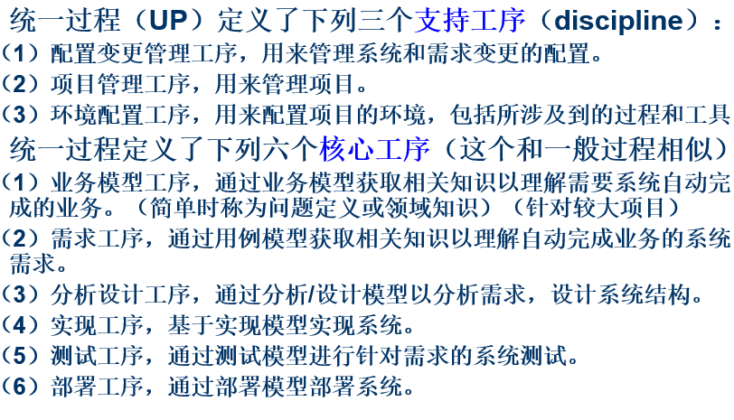
- **RUP**
  IBM提供支持和包装的UP系统
- **进化式迭代**
  它是统一开发过程的关键实践。开发被组织成一系列固定的小的短期项目，每次迭代都会产生经过测试、集成并可以执行的局部系统，且有各自的需求分析、设计、实现、测试，并在一次次迭代中增量式完成系统。
  每次迭代，需求和软件的完成度是各自增长的，有可能需求完善度很高，但软件完善度低

## // （习题2、3）针对每一种过程模型，讨论他的优缺点，以及该模型如何处理开发后期重要的需求变化
- **瀑布模型**
  参见上面
  如果严格执行原瀑布模型，那就难以处理后期的需求变化。即使是原型化瀑布，也需要在原型化阶段进行修改
- **V模型**
  
  V模型允许在过程的后半段对前半段的设计进行验证与确认，如果出现问题，应当立刻重新进行对应过程。
  这允许我们进行补救，后期出现重大需求时可以返回修改
- **原型化模型**
  
  每阶段都要进行原型化，基于原型的建立确认、评审并构建系统。
  优点在于各阶段的确认降低了开发的风险和不确定性
  缺点在于在软件规模较大时，原型会很复杂
  后期出现需求变更可以进入修订过程，返回调整
- **可操作性规格说明模型**
  要求我们使用可操作性的软件包作为向用户说明的材料
- **可变换模型**
  。。。（吐了）

## // 在所有的软件开发过程模型中，你认为哪些过程给予你最大的灵活性以应对需求的变更？
阶段开发模型和螺旋模型

# Chapter03
## 什么是项目进度？活动？里程碑？项目成本？
- **项目进度**
  项目进度是对特定项目的软件开发周期的刻画。
  这包括对项目阶段、步骤、活动的分解，对各个离散活动交互关系的描述，对各个活动的完成时间及整个项目完成时间的初步估算
- **活动**
  项目的一部分，占用项目进度计划中的一部分时间
- **里程碑**
  指标志着活动结束的特定时刻，通常伴随着某些提交物作为标志

## 如何计算软件项目活动图的关键路径？（习题2，3）冗余时间？最早和最迟开始时间（课堂习题讲解） 
- **计算关键路径**
  要注意：活动是边，点是里程碑
  - **step1：确定每个活动的最早开始时间**
    一个活动的开始的前提是完成他的前置里程碑的所有活动结束。简单来说就是一个活动的最早开始时间是到达它的开始节点的所有路径中最长的一个。
    在这一步，我们完全可以获得所有活动的最早开始时间。
  - **step2：确定每个活动的最晚开始时间**
    一个活动的最晚开始时间，取决于其达到的里程碑为起点的所有活动中，最小的最晚开始时间（因为最晚开始时间是不影响项目最快完成的“底线”，那么我们就要向着最早的最晚开始时间看起）。
    而对于“结束”这一里程碑，如果要按照这里的说法解决问题的话，我们可以认为：这个里程碑的“最小的最晚开始时间”就是项目结束的时间，也就是所有通往结束的路径中最长的那一条到达结束的时间。
    比如：如果有A、B、C三个活动指向结束，到达结束的时间分别为20、18、16，那么项目结束时间就是20，A、B、C都只需要在20时到达结束就可以，用20减去它们的活动耗时就行了。
    我们假设C耗时5，那C的最晚开始时间就是15。再假设D、E指向作为C的开始的里程碑，那么它们都只需要在15到达这个里程碑就可以，拿15减活动耗时即可
  - **step3：计算时差**
    时间 = 最晚开始时间 - 最早开始时间
- **冗余时间**
  即时差，它反映了一个活动可以延迟开始的时间量
- **最早和最迟开始时间、关键路径**
  最早开始时间顾名思义，最迟开始时间即最晚开始时间，即在不影响项目最快完成的前提下，最晚的开始时间。项目最快完成时间只取决于到达结束最晚的那条路径，这条路径称为关键路径。其余路径即使拖延一会也没问题
## // 软件团队人员应该具备的能力是什么？
- 完成工作的能力
- 工作兴趣
- 进行相关工作经验
- 经过培训
- 与他人交流的能力
- 共同承担责任的能力
- 管理能力

## 软件项目团队组织的基本结构？
- **主程序员负责制**
  主程序员负责所有决策，同时分配任务并监督成员。
  其余人向他汇报，并由主程序员进行最终决策并为此负责。
  副主程序员是二号人物，在必要时替代主程序员。
  资料员负责维护所有的项目文档，编译和链接代码，并对提交的所有模块进行初步测试。
  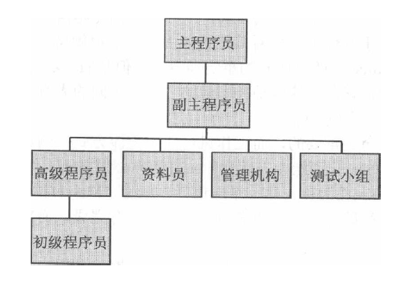
  - 优点：沟通成本低，决策快
- **忘我制**
  去中心化，全员参与决策、共担责任
- **队伍的结构性与特点**
  队伍的结构性越强，越能按时完成复杂任务，但也更加循规蹈矩，能给出普通但功能完备的成品，适合规模大的团队解决稳定的任务
  队伍的机构性越弱，创造性越强，越能对问题给出创造性的解决方案，但是不稳定，容易无法按时限完成任务，适合解决含有大量不确定因素的问题
## // 专家估算法的大致含义？算式估算法的大致含义？
- **专家估算法**：依赖于专家根据自身的经验，估算项目的大概工作量。总的来说是依赖经验。
- **算式估算法**：使用表示工作量和影响工作量的因素之间关系的模型进行估算，这种模型往往以方程式为模型。输入数据、得出结果。这种估算不直接依赖于经验，而是依赖于我们构建的算法模型。

## 试述COCOMO模型的三个阶段基本工作原理或含义。
COCOMO模型针对项目开发的不同阶段来设置工作量的衡量标准，逐步细化，逐渐准确
- **阶段一**
  阶段一中，项目通过构建原型来解决用户界面、软件、交互、性能、技术成熟度等方面的高风险问题
  在这一步，使用应用点AP来进行规模测量，比如估算屏幕数、报表数、组件数等
- **阶段二**
  阶段二中，设计者要考察集中可选的体系结构和操作的概念
  在这一步，使用需求文档中的功能点FP来进行规模测量
- **阶段三**
  阶段三中，开发已经开始，软件已经被部分构造出来
  在这一步，使用功能点FP和代码量作为衡量标准

## 什么是软件风险？了解主要风险管理活动？有几种降低风险的策略？
- **软件风险**
  软件生产过程中不希望看到的，有负面结果的事件。软件的风险有两方面：风险影响（即风险发生会造成的损失）和风险概率（即风险发生的概率）
- **风险管理活动**
  - **风险评估**
    包括风险识别，风险分析，风险优先级分配
  - **风险控制**
    包括风险降低，风险管理计划，风险化解
  （这里还有一个满血版……）
  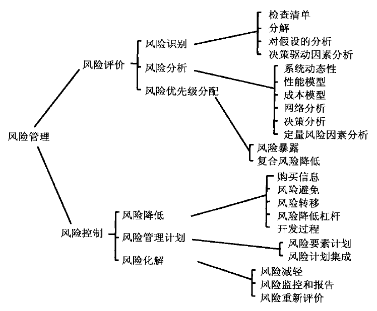
- **降低风险的策略**
  - **避开风险**
    改变功能和性能需求，避开可能的风险，例如：不用C改用Java来避免内存泄漏
  - **转移风险**
    设法将风险转移到其他系统中，或者买个保险来补偿风险发生时造成的损失（毕竟风险不是100%发生）
  - **假设风险**
    总假设风险会发生，接受它，并使用资源来控制风险的后果

## 弄懂活动图基本原理（参考课本），找出课后练习题--图3.23和3.24的关键路径。
这点可以参考上面的计算活动图。
活动图的点为里程碑，边为活动，代表着从一个里程碑开始，经过活动，走向下一个里程碑。
找关键路径，就找那个到结束最长的路就行了。

# Chapter04
## 需求的含义是什么？
是对来自用户的关于对软件系统的期望行为的综合描述，涉及对象、状态、约束、功能等
## 需求阶段作为一个工程，其确定需求的过程是什么？
- **原始需求获取**：从用户处确定系统应该干什么
- **问题分析**：通过分析，更好地理解需求，并通过模型或原型进行描述
- **规格说明草稿**：利用符号描述系统定义规范化的描述
- **需求核准**：开发人员和用户共同对需求进行核准，有时使用到原型进行测试
- **最终输出**：输出正式的软件需求规格说明书SRS

## 举例说明获取需求时，若有冲突发生时，如何考虑根据优先级进行需求分类。
- 绝对要满足的需求，例如：信用卡转账记录必须被持久化保存，并且可以列出，信用卡账单不保存是不可能的
- 非常值得要但并非必要的需求，例如：信用卡转账时要能实时发送给用户，这能极大的方便用户，但是非要说的话没有这个功能信用卡也能用
- 可要可不要的需求，例如：账单根据金额不同用不同的颜色显示

对优先级进行分类，我们就可以在开发受到限制，不得不做取舍时，根据优先级舍弃掉影响更小、必要度更低的需求
## // 如何使需求变得可测试？（sidebar4.4）
- 针对需求，确定一种量化的描述方法（使用形式化描述、数字、数据模型），避免模糊描述
- 将代词替换为实体的正式名称
- 每个名词在文档中都应该给出唯一定义

## 需求文档分为哪两类？
- **需求定义**：完整罗列用户客户期望中系统要做的事
- **需求规格说明**：将需求定义用技术术语和符号进行重述，描述为系统将如何运转的说明，设计者可以以此展开设计

## 什么是功能性需求和非功能性需求/质量需求？设计约束？过程约束？如何区分？
- **功能性需求**
  描述系统内部功能或系统与外部环境的交互功能，涉及系统的输入应对、实体状态变化、结果输出、设计约束、过程约束等
  功能性需求的特征是：它针对的是解决问题的方案和可选方案的边界
  - **设计约束**
    已经做出的设计决策或限制问题解决方案集合的设计决策。设计约束会让我们无法使用一些设计方案。
    设计约束包括：物理环境限制（如设备能力上限）、接口限制（如预定的输入输出格式）、用户限制（甲方有限制情况）
    设计约束是技术层面的
  - **过程约束**
    对于构建系统的技术和资源的限制。这个“技术”也包括软件开发模式等。
    过程约束包括：资源限制（如人员、材料、资金）、文档限制（如文档量有要求）等
    过程约束是外部要求层面的
- **非功能性需求/质量需求**
  描述软件方案必须具有的质量特征，比如响应时间、安全性、易用性等
  非功能性需求的特征是：它们不是用户想让系统完成的事，而是用户希望“完成的有多好”

## // 需求的特性？（正确性、一致性、完整性）
- **正确性**：开发者和客户都应该评审需求文档，以确保其正确表达了用户需求
- **一致性**：需求之间不能有冲突，如果两个需求不可能同时满足就破坏了一致性（五彩斑斓的黑）
- **无二义性**：要求需求描述的多个读者都能有效、一致地解释需求，不能千人千面
- **完备性**：指定了所有状态、所有约束下的所有可能输入对应的输出和必要的行为，才是一个完备的需求（即封闭，来啥都能有结果）
- **可行性**：需求的解决方案应当切实存在
- **相关性**：不应该有与解决问题本身毫不相关的需求，这破坏了相关性
- **可测试的**：需求应当能被测试证明被满足了
- **可跟踪的**：需求应当被组织好并唯一标识，在需求规格说明中容易找到

## 了解DFD数据流图的构成及画法。
数据流图描述数据如何流入系统，在系统中转换流动，并最终离开系统

**加工**：代表会对数据进行操作的行为
**数据集合**：同类数据的集合，数据贮存的地方
**外部项**：数据源或接收者
**数据流向**：字面意思，线上可以标注被传递的数据
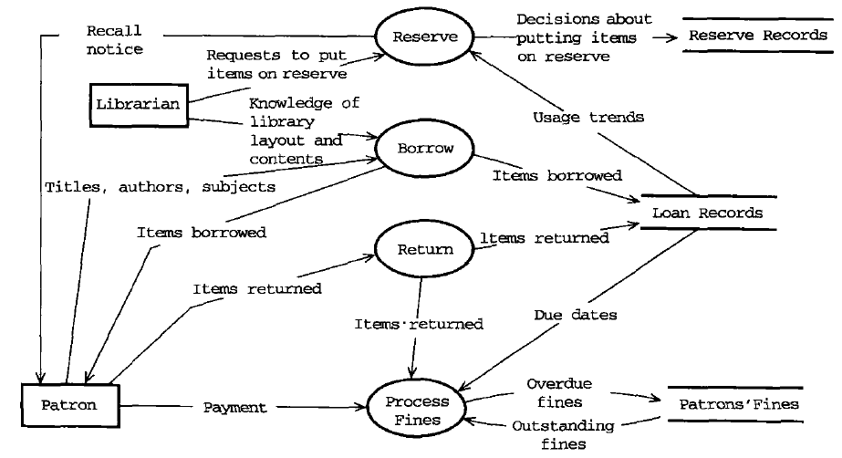
像这张图，标题、作者、类别的信息从用户流向借书操作，借书操作会把物品被借的数据输出到借阅记录处
## // 在需求原型化方面，什么是抛弃型原型？什么是演化型原型？
- **抛弃式原型**：仅用于了解问题，探索可行性而存在的原型软件，完全不打算作为将来提交的系统的一部分，用完即弃
- **演化型原型**：不仅用于了解问题，将来也会成为实际提交的系统的一部分

## // 用DFD图简单描述ATM机的工作原理（主要功能和数据流）（习题7）
额……
# Chapter05
## 什么是软件体系结构？设计模式？设计公约？设计？ //概念设计？技术设计？
- **软件体系结构**：一种软件解决方案，用于解释如何将软件系统分解为单元，单元之间如何相互关联，单元的所有外部特性
- **设计模式**：一种针对单个或少量软件模块给出的一般性软件解决方案，这种设计决策层次低于软件体系结构
- **设计公约**：一系列设计决策和建议的集合，用于提高系统某一方面的设计。当设计公约发展成熟时就会封装为设计模式或体系结构风格，甚至内嵌入程序语言。对象就是一个例子。

- **设计**：将需求中的问题转换为软件解决方案的创造性过程
  概念设计和技术设计是设计的两面
  - **概念设计**：面向用户的，告诉用户系统会做什么，即软件的架构与功能
  - **技术设计**：面向程序员的，告诉程序员系统将会怎么做来完成任务，即程序员参考文档

## 软件设计过程模型的几个阶段？
- **初始建模**：尝试对系统进行分解，根据需求描述的系统关键特性确定软件体系结构风格
- **分析**：分析软件系统的功能和质量属性、各种约束等
- **文档化**：确定各个不同的模型视图，进行文档化
- **复审**：检查文档是否满足所有功能及质量需求
- **最终输出**：软件体系结构图SAD

## // 三种设计层次及其关系？
- **体系结构设计**
  由软件需求中的系统能力与系统部件关联起来而得到软件整体结构的过程，这个过程约等于系统设计
- **代码设计**
  各个部分/模块的算法、数据结构设计
- **运行设计**
  最底层设计，例如内存分配、数据格式、位模式等
- **三者关系**
  工作流程应该是：先体系结构设计、代码设计、运行设计，并且开发中会不断往返各个过程

## // 什么是模块化？什么是抽象？
- **模块化**
  一种把系统中不相关的部分进行分离的原则，模块有清晰的输入和输出，设计目的明确，功能独立，可以被独立测试
- **抽象**
  对细节的隐藏称为抽象。

## 论述设计用户界面应考虑的问题。
- 设计界面时的要素（界面寓意、思维模型、导航、外观、给人的感觉）
- 文化差异问题
- 用户爱好问题

## 5.5节----模块独立性----耦合与内聚的概念及各个层次划分？举例说明耦合与内聚的基本分类。以及各个分类的含义与特征
- **模块独立性**
  模块之间彼此独立的程度
  模块独立性取决于内聚和耦合程度，我们追求的是高内聚、低耦合
- **耦合**
  - **概念**
    两个软件部件之间的相互关联程度
  - **层次划分**
    包括紧密耦合、松散耦合、低耦合
  - **细致分类（由低耦合到紧密耦合）**
    - **非直接耦合**
      模块之间没有信息交换
    - **数据耦合**
      模块之间传递数据，但不限定数据结构
      例如：传递水费、电费
    - **特征耦合**
      模块之间传递的是数据结构（这代表两者传递信息是使用了相同的数据结构）
      例如：传递水电账单
    - **控制耦合**
      模块间传递的是控制量，控制量由一个模块传出，作为另一个模块完成功能的必要条件，控制另一个模块的活动
      例如：一个模块传出一个flag给别的模块，别的模块根据flag执行不同操作
    - **公共耦合**
      不同模块访问公共的数据
      例如：大家一起访问全局变量
    - **内容耦合**
      一个模块直接修改另一个模块（直接调用另一个模块的私有数据，或者一个模块在另一个模块中）
      例如：A里直接有一个B对象
- **内聚**
  - **概念**
    模块内部各组成成分的关联程度
  - **层次划分**
    包括高内聚、低内聚
  - **细致分类（由低内聚到高内聚）**
    - **偶然性内聚**
      不相关的功能、过程、数据出现在同一个部件中
      例如：数据预处理，不同的模块在不同的步骤位置恰巧都有数据预处理，所以合并为一个模块
    - **逻辑性内聚**
      逻辑上相似或相关的功能或数据放置在同一个模块内
      例如：计算平均分和最高分都可以归纳为读数据、算、输出，那么读数据、输出就可以放进同一个模块里。虽然读和输出不能说有必然联系，但在系统中也可以理解为有逻辑相关性
      逻辑性内聚是几个功能整体上在几个流程的相似位置出现，从而有了逻辑的相关性，而不是偶然性内聚中表现的，完全不同的流程中的随机位置恰好有相似的部分
    - **时间性内聚**
      模块中各部分要求在同一时间内完成
      例如：一个初始化模块中有为变量赋初始值，打开文件等功能，这些功能不一定说谁是谁的前提，但是他们都必须在“初始化”这一段时间内完成
    - **过程性内聚**
      模块中的各部分有先后顺序
      例如：数据分析模块中有输入数据、检查数据、分析数据的过程，它们必须按顺序执行才行，前面不执行后面就不能执行
    - **通讯性内聚**
      模块中各个部分共享数据
      例如：一个传感器读取模块，里面的数据来自于各个传感器，彼此不一定相关，但是对模块内的各部分共享
    - **顺序性内聚**
      模块中的各个部分的输入与输出相连
    - **功能性内聚**
      模块中的各个部分只构成了一个单一功能

## 软件过程中复审的概念，设计复审的重要性。
- **设计复审**
  检查我们的软件设计、软件体系结构图是否满足了所有功能与质量需求
- **重要性**
  复审中批评和讨论是“忘我”的，能将开发人员更好地团结在一起，提倡并增强了成员之间的交流
  在评审过程中故障的改正还比较容易，成本还不高，在这时候发现故障和问题会使每一个人受益
- **概念设计复审**：与客户和用户一起检查概念设计
- **技术/程序设计复审**：让程序员可以参与复审，在程序实现之前获得本阶段的反馈

# Chapter06
## // 什么是面向对象？OO有几个基本特征？如何使用高级语言实现这些基本特征？
- **面向对象**
  是一种软件开发方法，它将问题及解决方法组织成一系列对象，将数据结构、动作都包括在内
- **OO的基本特征**
  - **标识**：确定对象的身份，唯一标识对象
  - **抽象**
  - **分类**：基于实体的功能、作用等因素逐步抽象出一个类
  - **封装**：封装一个类的行为和属性，不对外展示实现
  - **继承**：根据类的相同与不同，分层组织类，形成父类子类的继承关系
  - **多态**：通过子类对类都某些行为进行重定义，使得类同一个行为有不同的效果
  - **持久性**：对象的名字、状态要有进行持久化存储、不随程序关闭而消失的能力
- 最后这问题是个啥？告诉它Java里有接口、有重载实现多态？

## // 掌握并使用高级语言的OO基本编程方法和技巧。
。。。。？？？？

## 什么是设计模式？
设计模式是一套被反复使用的，多数人知晓并经过分类的代码设计经验的总结。
使用设计模式的目的是为了让代码可重用性高，让代码更容易被他人理解，保证软件质量

## 了解OO设计的基本原则？
- **总原则-开闭原则**：***对扩展开放，对修改关闭***
- **单一职责原则**：***一个类应该有且仅有一个引起它变化的原因，一个职责，否则类应当被拆分***
- **重用原则**：***尽可能不重复已写代码，尽最大可能复用***
- **里氏替换原则**：***继承必须确保超类所拥有的性质在子类中仍然成立***
- **依赖倒置原则**：***面向接口编程，依赖于抽象而不依赖于具体***
- **接口隔离原则**：***每个接口中不存在子类用不到却必须实现的方法，否则就应该拆分接口***
- **迪米特法则**：***一个类对自己依赖的类知道的越少越好***
- **（PPT中没提到）合成复用原则**：***尽量首先使用合成/聚合的方式，而不是使用继承***

## 了解OO开发有何优势？
- **语言的一致性**
  采用相同的语义结构（类、对象、接口、属性、行为）描述问题和解决方案
- **过程的一致性**
  需求分析和定义、高层设计、底层设计、编码、测试等各个过程全都采用相同的语义结构

## OO开发过程有几个步骤？
- **OO需求分析和定义**
- **OO高层设计**
- **OO底层设计**
- **OOP（面向对象编程）**
- **OO测试**

## 掌握用例图的组成和画法，用例的几个要素的含义。
- **用例**
  描述系统对外提供的功能
  
- **执行者/角色**
  与系统交互的实体
  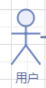
- **包含关系**
  指一个用例的行为完全包含了另一个用例的行为
  
- **扩展关系**
  向某一个更深的特殊情况扩展出用例的关系，箭头指向被扩展者
  

这里额外给出一个用例规约作为参考
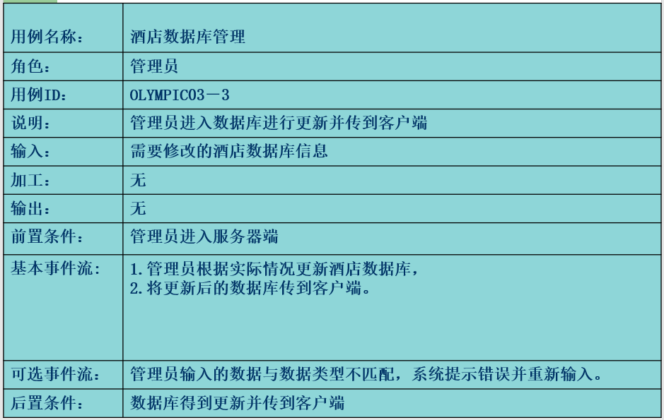
这些部分我认为比较关键
- 名称
- 角色
- 用例ID
- 说明
- 输入
- 输出
- 前置条件
- 基本事件流
- 可选事件流
- 后置条件
## 掌握用例图的实例解析方法，如何辨识和确定一个用例？
？？？

## 用例模型相关建模步骤是什么？
- 识别并描述参与者，确定角色。我们要找到：谁使用系统？谁从系统获取信息？谁为系统提供信息？
- 识别用例，给出简要描述。我们可以问自己：参与者用该系统做什么？参与者如何操作系统中的数据？
- 识别参与者与用例间的关联
- 给出每一个用例的详细描述
- 细化用例模型

## 用例图、类图等针对面向对象的项目开发的意义是什么？
- **用例图的意义**
  - 直观地阐明需求
  - 有助于找到需求中的缺陷
  - 需求本身就难以描述，用例图是描述的可靠工具

这些表示法每种都显现了系统的某个方面，因此相应地，这种表达也提供了对于问题或解决方案的详细描述。

## 熟悉类图中各个类之间的基本关系分类及其含义。
类图本身是分为三部分的矩形，三部分分别为：名字、属性、方法
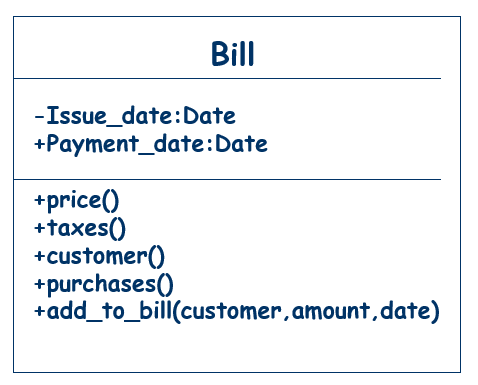
- **继承extends**
  ***箭头指向父类***
  
- **关联association**
  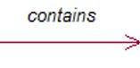
  ***箭头指向被依赖者***
  可以使用双向箭头表示双向关联
  一个类依赖另一个类可以认为是关联，比如属性中引用了另一个类
  还可以指明关联中双方的数量，比如一方会引用多个另一方：
  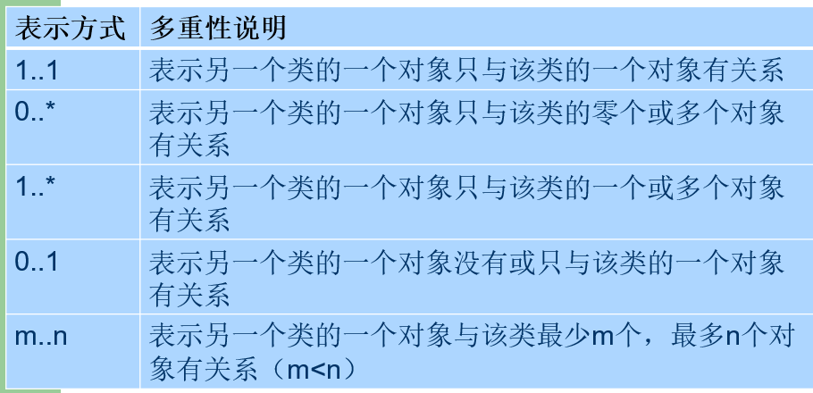
- **聚合Aggregation**
  ***箭头指向部分，菱形指向整体***
  表示一个事物的整体和部分，而且这个“部分”不在整体中也有意义，两者可以彼此独立存在
  
- **组合Composition**
  ***箭头指向部分，实心菱形指向整体***
  表示一个事务的整体和部分，这个“部分”的生命周期受“整体”影响，“整体”不存在时“部分”也就不复存在
  
- **依赖Dependency**
  ***箭头指向被依赖方***
  一个类的实现依赖于另一个类的关系，往往体现为一个类的方法的参数是另一个类
  
- **接口与实现**
  ***箭头指向被实现的接口***
  一个具体类实现一个接口的关系
  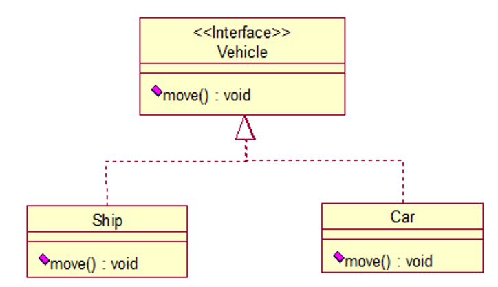
## // 状态图的含义及用途。
- 状态图用于展现一个对象所具有的所有可能的状态，并且它们在接收到什么信息时会进行怎样的转化
- 当你的对象会随着属性的改变而具有不同的行为时，使用状态图反映

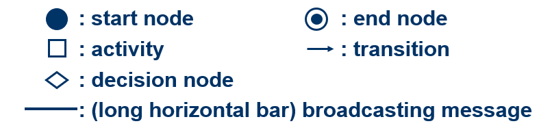
（状态图实例）

## 绘制类图最常用的方法及步骤是什么？
- **step1：确定类和属性**
  - 从需求中寻找对象
  - 可以先定义一个系统中应该有的部分，然后去需求中出现的名词中找到符合的
- **step2：确定行为**
  - 去需求里找动词
  - 思考确定的类应该有什么行为
- **step3：绘制**

## 熟悉用例图、类图、状态图的组成和画法。
用例图和类图参见前面
状态图也比较单纯（无了）
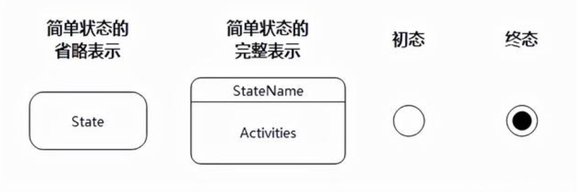
状态图从初态开始，终态结束，使用箭头将它们以及状态进行连接，箭头上应标注使状态发生改变的事件。初态引出的箭头要说明对象的生成，指向终态的箭头要说明对象因何终结

## 了解UML其他图示结构的基本用途。
- **用例图**：描述系统必须执行的一般过程
- **UML类图**：描述对象之间的静态关系
- **UML活动图**：描述业务活动的工作流模型，显示对象的值更改时系统中可能发生的所有活动
- **UML状态图**：展现一个对象所具有的所有可能的状态，并且它们在接收到什么信息时会进行怎样的转化
- **UML包图**：类进行打包，使设计更加层次化，易于理解，包图就是这个层次的图
- **UML顺序图**：展示活动或行为发生的顺序
- **UML通信图/UML协作图**：使用对象与对象之间的连接来描述对象间的消息顺序
- **UML构件图**：说明运行时的构件以及它们之间的交互
- **UML部署图**：描述如何为构件分配计算资源

# Chapter07
## // 为什么说编码工作是纷繁复杂甚至令人气馁？
- 设计并不总能直接了当地转化为编码
- 编码还得易于自己和他人理解
- 编码还得考虑重用问题
- 在编码时甚至也要检查设计

## 一般性的编程原则应该从哪三个方面考虑？
- **控制结构**：要让程序设计反映出在体系结构和设计中的各种控制结构
- **算法**：程序设计通常会制定一类算法，用于编写组件。不过在实现算法的编码过程中，自由度还是很大的。但是实现一个高性能的算法还可能引起隐性代价，比如难读
- **数据结构**：编写程序时，应该安排数据的格式并进行存储，让数据结构决定项目结构，并尽可能以此简化程序

## // 论述编码阶段实现某种算法时所涉及的问题。
- 编写更高效的代码可能有隐性时间代价
  - 编写难度提升
  - 测试耗时变长
  - 理解代码的耗时变长
  - 修改代码耗时变长
- 追逐高效可能牺牲程序清晰度和正确率

## 在编写程序内部文档时，除了HCB外，还应添加什么注释信息？注意什么？
- HCB是个啥？
  HCB，即**头部注释版块**，是总览性的信息，用于标识程序、描述数据结构、算法、控制结构。具体信息包括：
  - 名称
  - 编写者
  - 在系统中的位置
  - 编写时间
  - 如何使用的数据结构、算法、控制
- 还应该添加什么注释？
  - **版本注释**：随着时间进行修改的记录
  - **解释性注释**：本段源代码是在做什么的注释
  - **分解性注释**：通过注释将代码分解成多个段
- 编写内部文档还要注意什么？
  - 分段注释
  - 修改代码的同时也要修改注释 
  - 写代码同时就写注释，不延后
  - 注释要带来新的信息，通过变量名或者简单阅读代码就可以获得的信息是不用加入注释的
  - 使用有意义的变量名和标签
  - 使用统一易读的编码格式
  - 注释应当描述数据结构和它的用法，这一点在强调封装性的OO中尤为重要

## 敏捷方法的大致思想？什么是极限编程(XP)? 以及派对编程？
- **敏捷开发**
  敏捷开发理念认为：人与人之间的交互复杂、难以预期，但是这是开发中最重要的方面。
  敏捷开发强调人与人的交流，并且以“尽可能早地、持续地交付有价值的软件”为最高目标，而不是把时间精力都花在文档、谈判、计划上，随机应变，唯快不破。
- **极限编程XP**
  一种轻量级软件开发方法论，属于敏捷开发方法。
  极限编程强调四个特性，用以充分发挥开发人员的主动精神，适应环境和需求的变化：
  - **交流**：客户和开发人员持续交换看法
  - **简单性**：鼓励开发人员选择最简单的设计最快实现客户需求
  - **勇气**：敢尽早交付、经常交付
  - **反馈**：程序员和客户之间或者程序员之间针对各种开发过程对彼此进行反馈
- **派对编程/结对编程**
  两个程序员共同开发程序，且角色分工明确。一个负责编写程序，另一个负责复审与测试，并且两人定期交换角色

# Chapter08
## 了解产生软件缺陷的原因？
- 系统本身有太复杂的部分
- 客户不清晰的需求
- 设计阶段就存在缺陷
- 其他因素（规模、参与者过多）

## // 将软件缺陷进行分类的理由？
系统中不存在明显的故障时，我们就需要对程序进行测试，创造一些条件以期让代码不能像计划那样做出反应，看看有没有更多故障。而为了更容易发现这些故障，为故障进行分类时很重要的。
## 有几种主要的缺陷类型？
- **算法缺陷**：算法某些处理步骤或逻辑有问题，导致软件的部件对于输入数据不能给出正确的输出
- **计算和精度缺陷**：算法或公式在编程实现时逻辑没错，但是计算过程出现了错误或者精度达不到要求，从而无法获取正确输出
- **过载缺陷（压力缺陷）**：程序运行时，数据填充量会超过数据结构的规定容量引起的缺陷
- **能力缺陷（边界缺陷）**：系统活动量达到系统极限时，系统性能变的不可接受，称为能力缺陷
- **性能缺陷（吞吐量缺陷）**：系统在常规状态下就不能以需求规定的速度执行
- **时序性缺陷（协调缺陷）**：几个同时或有严格执行顺序的进程协调出现问题
- **文档缺陷**：文档描述与程序实际行为不符
- **恢复性缺陷**：系统失效时，程序无法再恢复也是一种缺陷
- **硬件和系统软件缺陷**：作为底层支持的硬件和系统软件没有按照文档中的操作条件和步骤运作时，也可能引起我们软件的问题，这就是硬件和系统软件缺陷
- **标准和规格缺陷**：代码没有遵守组织机构的标准和过程。这个缺陷最大的影响在于：不按照标准的代码可能在测试和修改时让人不好理解，引起问题

## 什么是正交缺陷分类？
使任意一个缺陷只属于一个类别的缺陷分类方案称为正交缺陷分类

## 测试的各个阶段及其任务？涉及的文档？（图8.3）
- **单元测试**
  验证组件的功能
  - 依据文档：程序代码与配套文档
- **集成测试**
  验证系统组件是否能正确的协同工作
  - 依据文档：系统体系结构文档SAD、程序设计规格说明
- **功能测试**
  验证系统是否能执行需求规格说明中描述的功能
  - 依据文档：软件需求规格说明书SRS
- **性能测试**
  验证系统的软硬件表现和性能是否符合需求规格说明文档
  这一步之后，软件系统应当能在客户的实际工作环境中成功执行，这时我们说产生了一个**被确认的系统**
  - 依据文档：软件需求规格说明书SRS
- **验收测试**
  验证系统是否满足了客户的需求定义（需求定义和需求规格说明是有区别的）
  - 依据文档：客户需求定义
- **安装测试**
  验证系统能否在用户使用的真实环境中安装并正常运行
  - 依据文档：用户环境的说明
- 系统测试 = 功能测试+性能测试+验收测试+安装测试

## // 测试的态度问题？（为什么要独立设置测试团队？）
- 新程序员不习惯将测试看作一个发现的过程，通常只想去展示正确之处、设计亮点、个人能力
- 客户只是单纯的希望系统在任何情况下都能正常运行，即使有时候提出的要求并不现实
- 我们应当以“忘我编程”的态度来测试，将组件看作系统的一部分而不是编写者的财产，尽可能地发现并修改缺陷，而不是谴责编写者
- 独立设置测试团队的原因
  - 避免试图掩盖错误，避免责任的行为
  - 各个阶段都可能引入故障，独立小组可以以最客观的态度排除这些缺陷
  - 允许我们先着手测试完成的部分，测试与编码同时进行

## 掌握测试的方法----黑盒、白盒的概念？
（完备的测试方法、流程往后看）
- **黑盒**
  测试人员在**完全不了解程序内部的逻辑结构和内部特性**的情况下，只依据程序的需求规格及设计说明，检查程序的功能是否符合它的功能说明。其原则是依据系统需求文档、系统设计文档、程序设计文档进行测试，正确的结果是系统完成了所有该做的，拒绝了一切不该做的
  - **优点**
    测试人员不受程序所带来的束缚，测试更具有客观性
  - **缺点**
    有时会无法进行完备的测试，在不知道程序内部逻辑的情况下，设计测试时就可能无法面面俱到
- **白盒**
  测试人员拥有全套文档，以**程序内部结构为基本依据**，手动或自动进行测试
  - **优点**
    有助于进行更细致、切中要害的测试
  - **缺点**
    全路径、极度细致的测试不现实

## 什么是单元测试？
- **定义**
  将每个程序构件与系统中其他构件隔离，对其单独进行测试
- **步骤**
  - **检查代码**
  - **测试程序模块**，其下又分几步
    - 确定测试的目标和计划
    - 选择测试用例
    - 执行测试计划
## // 什么是走查和审查？
两者都是检查代码的一部分
- **代码走查**
  程序员向评审小组提交代码和相关文档，评审小组非正式地进行讨论，注意力集中在代码上。发现缺陷，不必修改
- **代码审查**
  更正式的代码评审，评审小组事前准备好问题清单，依据清单来检查代码和文档

## 黑盒测试方法的分类，测试用例的设计和给出方法。
- **等价分类法**
  - **基本定义**
    将输入域划分为若干等价类，并且从每个等价类里选择有代表性的少量用例代表其余所有情况。其根本逻辑在于：如果这些代表性用例没有出现问题，那么其他的一般也没有问题
  - **有效等价类和无效等价类**
    等价类也分为有效等价类和无效等价类，有效等价类是正常输入，无效等价类是不应当输出正确结果的无效输入
  - **划分等价类的原则**
    划分等价类时要进行“密铺”式划分，并且尽可能不对测试的实体整体添加限制条件以提升可扩展性
  - **用例覆盖等价类的原则**
    对有效等价类的用例，尽量用一个用例覆盖尽可能多的等价类，这是因为任意一个有效等价类的处理出现问题都会产生故障，被我们发现，我们可以以此减少测试次数
    对无效等价类，必须为每一个无效等价类都设计一个专门验证该点的用例，这是因为所有无效等价类的表现都是不正常返回，不进行共用以避免多个错误一起发生导致漏过一些错误
  - **更细分的用例策略**
    - **弱一般等价类测试**
      每个一般等价类都至少出现在用例中一次即可
      基于单缺陷假设：失效很少因为两个或更多缺陷同时共同引发
    - **强一般等价类测试**
      用例应当遍历等价类的所有笛卡尔积组合
      基于多缺陷假设
    - **弱健壮等价类**
      考虑有效等价类之外，划分出的无效等价类，并且每个等价类在用例中至少出现一次即可
      仍基于单缺陷假设
- **边界值分析法**
  在等价分类法的基础上，把测试值选在等价类的边界上，经验告诉我们这往往有更好的效果
- **错误猜测法**
  根据测试人员的经验，猜测程序中哪些地方容易出错，并补充出用例
  此方法适合作为其他方法的补充
- **因果图法**
  课上没有什么介绍

## 白盒方法的分类，各种覆盖方法等。
- **逻辑覆盖法**
  一组逻辑覆盖方法的统称。按对程序逻辑覆盖程度的由低到高，分为：
   - **语句覆盖**：每条语句至少执行一次
   - **判定覆盖（又称分支覆盖）**：每一分支至少执行一次，又称分支覆盖
   - **条件覆盖**：每个条件均按“真”和“假”两种结果至少执行一次
   - **\*条件组合覆盖**：某个分支的虽然只有一种结果，但可能由多个条件组合而成。条件覆盖只要求单个条件一次真一次假即可，条件组合覆盖要求覆盖所有组合，即使有些组合最终结果一样。
- **路径测试法**
  - **定义**：借助程序图设计测试用例
    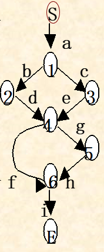
  - **结点覆盖**
    意味着要经过所有结点
  - **边覆盖**
    意味着覆盖所有边
  - **完全覆盖**
    同时满足结点覆盖和边覆盖，也即走过所有位置，这是测试简单程序的最低标准
  - **路径覆盖**
    程序图中每条路径都至少经过一次
    路径覆盖法与穷举测试有所不同，路径覆盖法并不关注循环次数，某个循环语句循环1次和n次对于路径覆盖法是一样的，但是穷举测试则认为它们是不同的。
## 如何面对一个命题，设计和给出测试用例的问题。（课件）
在集成测试及以后的阶段，除去很小的程序，都应当使用黑盒。这一具体流程包括：
- 使用边值分析法或等价分类法提出基本的测试用例
- 使用猜错法补充一些测试用例
- 如果在程序的功能说明中含有输入条件的组合，宜在一开始就用因果图法，然后再按以上两步进行

对于单元测试，我们往往可以直接参考模块的源代码，并且工作量可以承受，所以宜采用黑盒法白盒法结合运用
- 先使用黑盒法设计测试用例，然后使用白盒法进行补充，达到我们期望的覆盖标准
- 或者先用白盒法设计测试用例，再根据模块功能说明，使用黑盒法补充

## 有关设计测试用例，要参考ppt的例题

## 集成测试及其主要方法的分类？（驱动模块、桩模块的概念）
验证系统组件是否能正确的协同工作
选择策略要兼顾系统特性和客户需求
- **驱动模块**：代替上级模块传递测试用例的程序（出现在自底而上集成测试中）
- **桩模块**：代替下级模块的仿真程序（出现在自顶向下）

- **集成测试分类**
  - **自底向上集成测试**
    从模块结构图的最底层开始，由下而上按调用关系逐步添加新模块，组成子系统分别测试，直到全部组装完毕
    典型特征是：添加的新模块调用的下层模块都必须被全部测试完毕
    使用驱动模块
    - **优点**
      - 容易生成测试用例（因为底层都是真实模块）
      - 适合面向对象方法（每次加入的是经过测试的对象，也符合消息的传递方式）
      - 当许多低级组件经常在各个地方被调用时，这种方法十分适用
    - **缺点**
      - 许多存在于高层模块中的关键错误无法被及时发现
  - **自顶向下集成测试**
    从顶层控制组件开始进行测试，然后逐步将调用的下级组件组合起来，再对更大的子系统测试，直到全部组装完毕
    典型特征是：添加的新模块，调用它的上层模块必须被测试过
    使用桩模块
    - **优点**
      - 上层的问题常常是影响更大的，自顶向下更利于发现这些关键问题
    - **缺点**
      - 生成测试用例更难
      - 可能需要很多桩
    - **改进的自顶向下集成测试**
      在自顶向下集成测试的基础上，每次合并之前都对新的一层中的构件进行单独的测试
      这样可以避免自顶向下测试需要大量的桩的问题（我并不知道为啥……我想不明白）
  - **莽撞测试**
    一次性集成所有模块，冲冲冲！
  - **混合方式测试/三明治方式**
    从上到下将模块分为三层：上层、目标层、下层。上层自顶向下，下层自底向上，中层直接使用驱动模块+桩模块独立测试，最后集成三层

## 传统测试和OO测试有何不同？OO测试有何困难？
- **OO测试有何不同**
  传统测试，系统发生改变时，我们只需要针对改变在原来的用例基础上，推出新的用例即可
  OO测试需要在子类被重写时，我们需要重新测试，并可能需要使用不同的测试用例
  OO测试，在单元测试中更加简单（对象的粒度更小），但是集成测试更难（设计接口、继承、多态等）
- **OO测试有何困难**
  - 需求文档的验证缺乏工具支持
  - 测试工具生成的测试用例往往不能很好的处理OO模型中的对象和方法
  - 传统的测试方法在评价OO系统的规模和复杂度时并不是很有效
  - 对象的交互是OO系统复杂性的根源，传统的测试方法和经验的作用有限

## // 测试计划涉及的几个步骤？（了解）
- 制定测试目标
- 设计用例分类
- 书写测试用例
- 复审测试用例（有时可以用程序对测试用例进行测试）
- 运行测试
- 评价测试结果

# Chapter09
## 系统测试的主要步骤及各自含义？（图9.2）
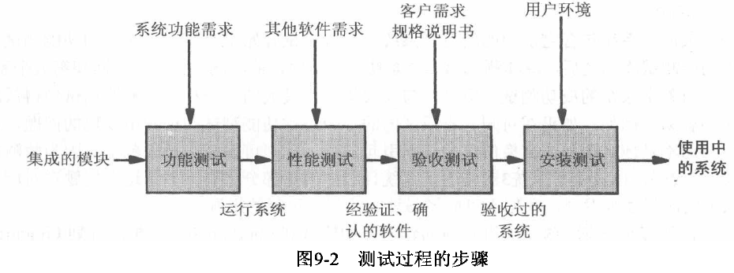
- **功能测试**
  验证系统是否能执行需求规格说明中描述的功能
  - 依据文档：软件需求规格说明书SRS
- **性能测试**
  验证系统的软硬件表现和性能是否符合需求规格说明文档
  这一步之后，软件系统应当能在客户的实际工作环境中成功执行，这时我们说产生了一个**被确认的系统**
  - 依据文档：软件需求规格说明书SRS
- **验收测试**
  验证系统是否满足了客户的需求定义（需求定义和需求规格说明是有区别的）
  - 依据文档：客户需求定义
- **安装测试**
  验证系统能否在真实环境中安装并正常运行
  - 依据文档：用户环境的说明

## // 什么是系统配置？软件配置管理？基线？（或见课件）
- **系统配置**：交付给特定客户的一系列部件的集合
- **软件配置管理**：对系统不同的软件配置的管理及控制方法（即有开发、也有测试），通过控制系统差别以降低风险、减少错误
- **基线**：软件文档和其他资料的集合，代表了产品在某一时间点的情况

## 什么是回归测试？
用于新版本的一种测试，验证它与旧版本相比，是否仍以相同的方式执行着相同的功能

## 功能测试的含义及其作用？
- **定义**
  测试SRS（软件需求规格说明书）中的功能性需求
- **作用**
  以高检测率发现缺陷
  （因为一项功能测试只面向一小组组件，不容易导致多个缺陷彼此掩盖）

## 功能测试的基本指导原则？
- 要具有较高的查错率
- 使用独立的测试团队
- 了解预期的输出结果
- 对合法和非法输入都进行测试
- 不能为了测试方便而去修改系统
- 制定测试停止的标准

## 性能测试的含义与作用？
性能测试比功能测试更难
需求定义要足够完备才能保证性能测试成功进行，需求质量通常可以反映在性能测试的容易度上
- **定义**
  测试SRS中的非功能性需求，例如：性能、准确度等
- **作用**
  确保系统的可靠性、可用性和可维护性

## 性能测试的主要分类？
- **压力测试/强度测试**：短时间内加载极限负荷，验证系统能力，对经常产生负荷高峰的系统很有意义
- **容量测试/巨额数据测试**：验证系统处理巨量数据的能力
- **计时测试**：评估涉及对用户的响应时间以及功能执行耗时的相关需求
- **配置测试**：对系统软硬件的各种配置进行测试
- **兼容性测试**：测试其接口在与其他系统互动时能否正常运作
- **环境测试**：测试系统在安装场所的执行能力，这里指的是外部的物理条件，比如高温、潮湿
- **回归测试**：验证软件的新版本与旧版本相比，是否仍能以相同的方式执行着相同的功能
- **安全性测试**：确保安全性需求得到满足
- **质量测试**：评估系统的可靠性、可维护性和可用性
- **恢复测试**：检验系统是否能在故障或丢失电源、数据、设备时自我恢复
- **维护测试**：核验一些诊断工具和过程是否能正常运行，如：诊断程序、事务跟踪、辅助工具
- **文档测试**：确保编写了必要的文档
- **人为因素测试/可用性测试**：检查设计系统用户界面的需求

## // 什么是可靠性、可用性和可维护性？
- **可靠性**
  软件系统在给定的时间范围和条件下运行成功的概率
- **可用性**
  软件系统在给定的时间点成功运行的概率
  可用性强调某一时刻系统正常，系统可能在相当长一段时间内都可用，保持了可靠性，但在不能使用（例如检修）的那一刻，它失去了可用性
- **可维护性**
  是指在给定的使用条件（包括：预定的时间间隔、可用的维护程序、可用的维护资源之下进行维护）下，维护活动能被执行的概率

## 确认测试（估计就是验收测试）的概念，确认测试的分类？（基准测试和引导测试）
- **定义**
  由客户检查软件系统是否满足了他们的需求定义，主导者是客户，开发者只负责解答一些必要的问题
- **分类**
  - **基准测试**
    先由用户准备测试用例，然后在实验环境中安装系统，最后由用户进行评估
  - **引导测试**
    先将系统安装在实验环境中，然后在假设系统正式安装的前提下，由测试者在测试系统上进行日常工作，而不是依赖于测试用例
    α测试和β测试都属于引导测试
  - **并行测试**
    当软件的一个旧版本正在使用，并且要测试一个新版本时使用
    新旧版本并行运转，来自用户的操作会同时在新旧系统上执行，旧系统实际工作，新系统进行测试，使用户逐渐习惯新系统
## 什么是alpha测试？β测试？
α测试和β测试都属于引导测试
- **α测试**：有开发者自己组织人员或委托专业团队来进行小规模测试
- **β测试**：由客户实际进行小规模测试

## 什么是安装测试？
验证系统能否在用户使用的真实环境中安装并正常运行，以发现并解决因开发环境和用户环境不同所引起的问题